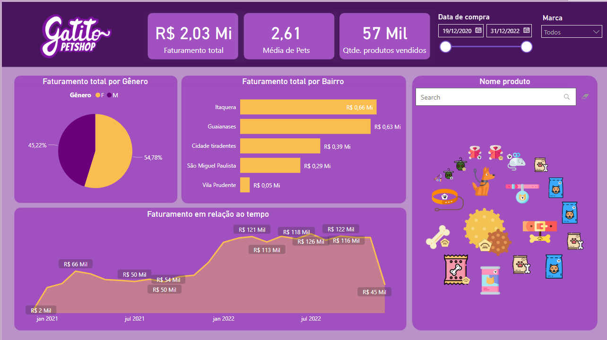

  
  

# Business Insights Gatito: Turning Data into Action

## Business Problem

Helô works as a manager at the e-commerce company called Gatito Petshop, which faces challenges regarding data analysis, aiming to boost the growth of its activities. In order to cope with the large amount of information available, the organization implemented a new Business Intelligence (BI) tool. However, part of the BI team still lacks familiarity with the effective use of this tool and its potential to add value to the company's internal processes.

As a manager, Helô aims for the BI team to collect, integrate and process data from different sources, thus providing relevant and valuable insights. Such information can then serve as a basis for making strategic decisions and boosting the overall performance of the enterprise.

In this context, the primary purpose of this project is to design a Dashboard that offers meaningful and useful insights, with a view to enriching the organization's processes.

## Assumptions assumed for analysis

To perform data analysis to drive business growth, we make the following assumptions:

- Data Availability: It is assumed that the company has access to the relevant data necessary for the analysis. This includes sales information, customer data, product inventory, and other pertinent data sources.
- Data Quality: An integral part of this analysis is the assumption that the available data is accurate and reliable. Therefore, it is critical to assume that the data is free from substantial errors or inconsistencies.
- Variety of Data Sources: The analysis must consider data from various sources, such as internal databases, spreadsheets, online sales records, among others. This diversity of sources is considered to obtain a complete view of the business.
- Analysis Objectives: It is assumed that data analysis has as its main objective the identification of relevant insights and trends to drive business growth and make informed strategic decisions.
- BI Tool Adoption: It is assumed that the BI team will effectively utilize Microsoft Power BI to collect, integrate and process data, as well as create relevant data visualizations.
- Data Update: The analysis assumes that the data is updated regularly, allowing a real-time view of the company's operations.
- Flexibility for Change: It is recognized that, although the assumptions are based on the information available at the time of analysis, the business environment is dynamic, and conditions may evolve. Therefore, the analysis strategy must be flexible to adapt to new information and unpredictable events.

## Solution strategy

In order to develop a Dashboard, we proceed according to the following steps:

Step 1: Collect sales data, customer data and product data.

Step 2: Integrate data from different sources into a central repository, ensuring it is up-to-date and available for analysis.

Step 3: Carry out thorough data cleaning and validation to ensure the quality and reliability of the information, identifying and correcting errors or inconsistencies.

Step 4: Carry out a descriptive analysis to understand the company's current situation.

Step 5: Perform deeper analysis with exploratory data analysis techniques to identify patterns and trends in the data.

Step 6: Identify relevant insights that can drive Gatito Petshop's growth and operational efficiency.

Step 7: Create an interactive dashboard in Power BI that presents insights in a clear and visually appealing way.

This solution strategy aims to use available data to drive the growth and operational efficiency of the Gatito Petshop company, ensuring data quality and reliability and adapting to changes in the business environment.

## Top 3 Data Insights

1. The "Cachorrito" product brand achieved a higher total revenue than the "Gatito" brand, suggesting a significantly greater demand for this product category.
2. We identified that the "Itaquera" and "Guaianases" neighborhoods are the main drivers of the company's total revenue, while the "Vila Prudente" neighborhood has a smaller impact on financial results.
3. We note that the "Guia" product stands out as the main source of revenue, while the "Petisco" product registers the smallest contribution to the company's financial result.

## Result

## Conclusion

Given the context presented and the steps followed to build the Dashboard with valuable insights, it is possible to highlight the importance of efficient data analysis to boost the growth and operational efficiency of the Gatito Petshop company. The Manager, Helô, led a strategy that considered crucial premises, such as the availability of reliable data, the variety of information sources and the flexibility to adapt to the business environment.

The analysis revealed relevant insights, such as the superiority of a given product brand in terms of revenue, the identification of key neighborhoods that contribute significantly to the financial result and the performance differentiation between specific products.

These insights not only provide a clearer view of Gatito Petshop's business dynamics, but also establish a path for making informed strategic decisions, such as inventory adjustments, marketing strategies or operational optimizations.

Therefore, data analysis, combined with the construction of the Dashboard, demonstrates its potential to add value to the organization's processes, promoting the continuous search for solid and efficient growth in the e-commerce market. This project represents a fundamental step towards more informed and data-driven management at Gatito Petshop.

## Next steps

- Publish the dashboard on the web, in the Power BI Service.
- Communicate insights and recommendations to the management team and stakeholders clearly and persuasively.
- Collaborate with the management team to implement the necessary recommendations and changes based on the insights generated.
- Monitor and evaluate the results of implemented changes, adapting the strategy as necessary.
- Remain open to adjustments to the analysis strategy as new information and unpredictable events emerge, maintaining responsiveness to changes in the business environment.
